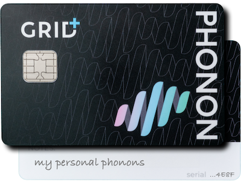

# Getting Started

The following explanations of Phonon are written in two formats, simple and technical.  The goal is to better understand Phonon, no matter what your technical experience is.

## What is a Phonon?



**A Phonon is something that secures and holds a digital asset**, such as an Ether amount or an NFT. To elaborate on this a bit more, a Phonon is like a safety deposit box, containing a single asset that can be transferred to another party, without history of the transaction, without the internet, in a true peer-to-peer transfer. In a similar fashion as physically handing over a safety deposit box to your friend, you can do this with Phonon.  Phonon has many of the same properties of cash, digitally.  And much more.

Phonon has the potential to change the way we exchange assets, conduct commerce and ultimately have true ownership of our assets. The Phonon Protocol is reshaping what digital cash could be, with the agnosticism of the underlying asset. It's a mission to Mars, but in the same sense, monumentally achievable.



**A phonon is a representation of a public/private key pair and ancillary information describing the encumbered digital asset** (e.g. a Bitcoin UTXO or ERC20 token) to that key pair. In this way, exchanging phonons is a secure mechanism of exchanging private keys, and consequently exchanging ownership of a digital asset without ever broadcasting a transaction to the asset's associated network/blockchain.

Traditionally, exchanging private keys would expose a user to significant counterparty risk; the recipient has no way of knowing that the sender didn't keep a copy of the private key to steal the assets back. **The Phonon Protocol solves this problem, by ensuring private keys are never known publicly, and are only transferred between cards which can be trusted** to atomically delete its copy of a phonon after it has been transferred. In this way, when transferring between phonon cards, the receiver can be confident that the received private key is only known to his card, and therefore the digital assets encumbered to his phonon's key are solely his. To ensure phonons are not duplicated, cards will only transact with other valid Phonon cards, which can be trusted to abide by the network rules. Accordingly, each card first checks if the other card possesses a certificate signed by a valid issuer. Communication between cards is encrypted using the cards' unique keys, to prevent transactions from being broadcast to multiple cards.

This functionality relies on the following key principles:

* A phonon private key must be known only to a trusted phonon card (until withdrawal from the network).
* After sending or withdrawing a phonon from a card, that card will destroy its record of the phonon.

Learn more by <mark style="color:red;">reading the Phonon Protocol</mark>. The Phonon protocol software is open sourced and <mark style="color:red;">available here</mark>.



## What is a Phonon card?



**A Phonon card is like your own personal bank** which holds your Phonons (think safety deposit boxes).  The card is secured by a PIN you can set. When you unlock the card, you can see the list of Phonons held on the card.  You can also create new Phonons, transfer Phonons (to another Phonon card) and redeem Phonons.

<figure><figcaption>
Example of a Phonon card
</figcaption></figure>

**A Phonon card has a similar look and feel as a modern credit card** which uses the same chip technology as your Mastercard or Visa card.  The Phonon card has a chip exclusively. There is no magnetic strip on the back.  When the card is inserted into a card reader that interacts with a device with Phonon software, you can perform the actions mentioned above.



A Phonon card leverages the hardware security of secure-elements/HSMs to allow the secure storage and transfer of Phonons. When a new card is issued, the card's security module is flashed with the  Phonon protocol applet and a certificate for creating future Phonons.  The certificate authority is owned and managed by the Phonon DAO <mark style="color:red;">(??)</mark>.&#x20;

**Orchestrating a secure Phonon transfer** requires a specific set of steps to be accomplished in a specific manner, in order to properly leverage the security guarantees provided by multiple systems, such as the Phonon-card secure applet, the Phonon-client, the underlying Phonon asset’s original blockchain, as well as the same stack on the counterparty’s side.

> As we know, a Phonon is essentially a data structure containing the requisite information needed to control a digital asset.

**Typically**, this is a private key along with metadata describing how to locate the asset on its origin blockchain. Phonons have private data, typically the private key, which remains hidden from all, including the owner of the Phonon, and public data, typically everything else such as the originating chain name, the description of the asset, and its on chain value.

While the **Phonon-card applet itself guarantees the secrecy and security of the asset private keys**, it is still necessary that care be taken when transferring Phonons between counterparties to ensure that each party is sending and receiving the digital assets they intend.&#x20;

> **For example**, a recipient of a Phonon needs to check that the Phonon they are receiving actually represents the digital assets it claims to. Since Phonon cards inherently only possess information that their users have given them, the public metadata (aka Phonon descriptor) for each Phonon is entered by the user without any verification. The consequence of this is that Phonon descriptor information is inherently insecure, it must be checked by the receiving counterparty in order to ensure its veracity.

Essentially, the only security guarantee about a Phonon that the secure applet can make is that it does in fact possess the private key corresponding to a certain public key, and that that private key has remained hidden inside of a Phonon during its entire lifecycle and will continue to do so until it is redeemed. **This is the core property that prevents double spends**, but it means that the client will have to take on the additional responsibility of validating that Phonon assets intended for transfer are legitimate blockchain assets.

To interact with the Phonon-card applet,&#x20;

There are multiple interfaces that are available to interact with the Phonon card.  You can <mark style="color:red;">learn more about these interfaces here</mark>.

The Phonon protocol applet software is open sourced and <mark style="color:red;">available here</mark>.



## How does Phonon work?



There is essentially 3 core utilities behind how Phonon works.

1. Creating a Phonon
2. Transferring a Phonon
3. Redeeming a Phonon

Here's an overview of how each works:

#### Creating a Phonon

A Phonon is created by first securing a digital asset onto a blockchain and then secured onto a Phonon Card. This can be done in numerous ways. For example, you could use the Phonon Manager to create a Phonon from an asset you have stored in a wallet such as MetaMask. The creation of the Phonon will hold the keys on the Phonon Card, much like how a wallet such as MetaMask held the keys to that asset. You're essentially transferring the keys into a Phonon. This means you can only access that asset encumbered within a Phonon by having access to the Phonon Card itself. The Phonon protocol software has the ability to do things such as transfer or redeem said Phonon.

&#x20;&#x20;

#### Transferring a Phonon

A Phonon is transferred by sending someone the Phonon. In short, the Phonon is sent to a recipient, in which only the recipient's card is eligible to accept the transfer.  The Phonon is sent in an enclosed message and can be send using common methods including email, SMS, and WhatsApp.  When the user receives the Phonon transfer, they can choose to accept or deny the transfer. If denied, then it is returned to the sender. The send would need to re-add it to their card by accepting the return transfer.  Otherwise the recipient can accept the transfer and it will be added to the intended recipients Phonon Card.

#### Redeeming a Phonon

A Phonon can be redeemed for it's encumbered asset by making a request using software such as Phonon Manager. Redeeming an asset will require the user to determine where it's being redeemed to, such as a MetaMask wallet. Redeeming will transfer the asset to the requested destination, destroying the originating Phonon in the process.







## How can I try Phonon?



Currently, the Phonon Protocol is geared more towards tech savvy enthusiasts and developers. Future software releases, including the release of the upcoming Phonon Manager will make it easier to use Phonon as an everyday user.







## How can I contribute to Phonon?



If you'd like to technically contribute to the Phonon Protocol, here's a few places to get started:

* [Discord](https://discord.gg/NkcSBGfG) - This is where the core conversations happened, check out the group of channels under TECHNICAL DISCUSSIONS. Feel free to introduce yourself and join the discussions.
* [Documentation](the-phonon-protocol/) - Get familiar with what Phonon is, how the protocol works, and how to get started with development.
* [Github Project](https://github.com/orgs/GridPlus/projects/18) - This is where we keep track of the progress of work done on the protocol.



If you'd like to  contribute to the Phonon Protocol, but don't have the technical background, here's where to get started:

* [Discord](https://discord.gg/NkcSBGfG) - This is where the core conversations happened, check out the group of channels under WORKING GROUPS. Feel free to introduce yourself and join the discussions.
* [Documentation](the-phonon-protocol/) - Get familiar with what Phonon is, how the protocol works, and how to use Phonon
* <mark style="color:red;">Github Project</mark> - This is where we keep track of non-development progress for things related to Phonon. If you'd like to contribute artistically (illustrations, animations, etc.), you'll see what we're looking to complete here.  If you have other ideas, we'd love to hear them! Connect with us in Discord.


